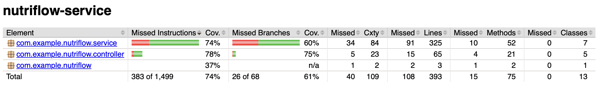
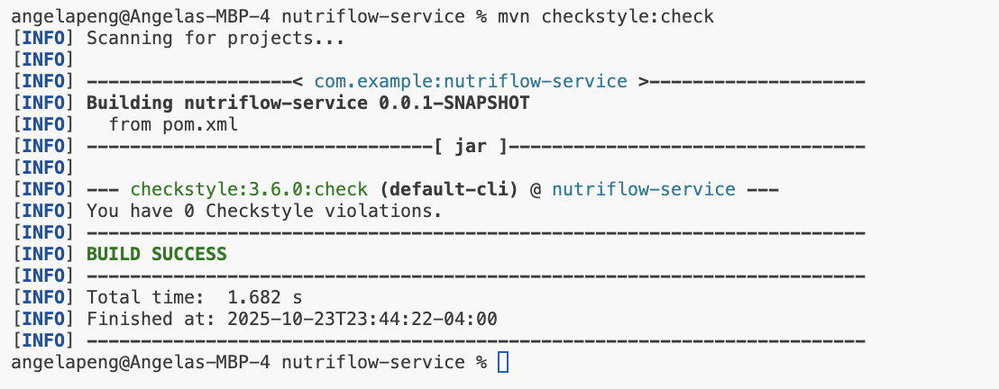

# NutriFlow
## Overview

NutriFlow is a personalized nutrition and recipe recommendation platform.
This milestone implements core backend modules for user data management, pantry tracking, and recipe retrieval, built with Spring Boot, Spring Data JPA, and PostgreSQL.

## How to Run

### Prerequisites
1. **Java 17** (required)
```shell
export JAVA_HOME=$(/usr/libexec/java_home -v 17)
export PATH="$JAVA_HOME/bin:$PATH"
java -version
```  
(Ensure it prints a Java 17 version.)

2. **PostgreSQL** (for local development)
- Create a database named `nutriflow`
- Update credentials in `nutriflow-service/src/main/resources/application-local.properties`

### Setup and Build
Navigate to the service directory:
```shell
cd nutriflow-service
```

Compile the project:
```shell
mvn clean compile
```

### Run the Application

**Quick Start** (recommended):
```shell
./start.sh
```
`start.sh` will automatically:
1. Kill any process using port `8080`
2. Verify Java 17 is active (and warn if not)
3. Verify PostgreSQL `nutriflow` database is reachable
4. Start the Spring Boot app with the `local` profile

**For Local Development** (uses local PostgreSQL):
```shell
cd nutriflow-service
mvn spring-boot:run -Dspring-boot.run.profiles=local
```

**For Production** (uses Google Cloud SQL):
```shell
cd nutriflow-service
mvn spring-boot:run
```

The service will start on `http://localhost:8080` by default.

**Troubleshooting:** If you get "Port 8080 already in use" error:
```shell
lsof -ti:8080 | xargs kill -9
```

### Code Quality Checks

**Run CheckStyle** (verify code style compliance):
```shell
cd nutriflow-service
mvn checkstyle:check
```

**Run Tests**:
```shell
cd nutriflow-service
mvn test
```

**Generate Test Coverage Report**:
```shell
cd nutriflow-service
mvn clean test jacoco:report
```
Then open the report:
```shell
open target/site/jacoco/index.html
```

## Testing Frameworks
This project uses the following testing and mocking frameworks:

- **JUnit 5 (Jupiter)**
- **Mockito 5.11.0**
- **Spring Boot Test**

## Project Management Software
https://trello.com/b/wPgSYaB3/coms-4156-project

## Implemented Features
### User Management

Purpose: Manage basic user information including personal details, dietary preferences, and cooking capabilities.

Modules:
- Entity: User
    - Fields: userId, name, height, weight, age, sex, allergies, dislikes, budget, cookingSkillLevel, equipments, timestamps
- Repository: UserRepository
    - `findUserById(Integer userId)`
    - `existsById(Integer userId)`
- Service: UserService
    - `getUserById(Integer userId)` → retrieve user information by ID
    - `updateUser(Integer userId, UpdateUserRequestDTO request)` → update user information (supports partial updates)
- Controller: UserController
    - `GET /api/users/{userId}` → retrieve user basic information
    - `PUT /api/users/{userId}` → update user information

### User Nutritional Targets

Purpose: Store and manage daily nutritional targets for users including macros and micronutrients.

Modules:
- Entity: UserTarget
    - Fields: targetId, userId, calories, protein, fiber, fat, carbs, iron, calcium, vitaminA, vitaminC, vitaminD, sodium, potassium, timestamps
- Repository: UserTargetRepository
    - `findLatestByUserId(Integer userId)`
- Service: UserTargetService
    - `getUserTargets(Integer userId)` → retrieve user's latest nutritional targets
    - `updateUserTargets(Integer userId, UpdateUserTargetRequestDTO request)` → update or create user nutritional targets
- Controller: UserController
    - `GET /api/users/{userId}/targets` → retrieve user nutritional targets
    - `PUT /api/users/{userId}/targets` → update user nutritional targets

### Health Statistics

Purpose: Track user health metrics over time and provide BMI calculations and historical data analysis.

Modules:
- Entity: UserHealthHistory
    - Fields: historyId, userId, weight, height, bmi (auto-calculated by database), recordedAt
- Repository: UserHealthHistoryRepository
    - `findByUserIdOrderByRecordedAtDesc(Integer userId)`
- Service: HealthStatisticsService
    - `getHealthStatistics(Integer userId)` → retrieve comprehensive health statistics
- Controller: UserController
    - `GET /api/users/{userId}/health_statistics` → retrieve user health statistics with BMI calculation and historical records

### Recipe Management

Purpose: Store and retrieve recipe data, including nutritional information and popularity ranking.

Modules:
- Entity: Recipe
    - Fields: title, cuisines, tags, ingredients (JSONB), nutrition (JSONB), macros, popularity score
- Repository: RecipeRepository
    - Custom query: findPopularRecipes(`Pageable pageable`)
- Service: RecipeService
    - `getRecipeById(Integer id)`
    - `getPopularRecipesDefault()` (top 5)
    - `getPopularRecipes(int limit)` (custom size)
    - `getUserFavoriteRecipes(Integer userId)`
- Controller: RecipeController
    - `GET /api/recipes` → list all recipes (handy for discovering recipe IDs)
    - `GET /api/recipes/{id}` → retrieve recipe by ID
    - `GET /api/recipes/popular?limit={n}` → retrieve top N recipes
    - `GET /api/recipes/search?ingredient={keyword}` → search by ingredient keyword
    - `GET /api/recipes/favorites/{userId}` / `POST` / `DELETE` → manage favorites

### Pantry Management

Purpose: Enable users to manage ingredients they currently have at home.

Modules:
- Entity: PantryItem
    - Fields: itemId, userId, name, quantity, unit, timestamps
    - Auto-managed timestamps via @PrePersist and @PreUpdate
- Repository: PantryRepository
    - `findByUserId(Integer userId)`
- Service: PantryService
    - `getPantryItems(Integer userId)`
    - `updatePantryItems(Integer userId, List<PantryItem> items)` replaces user’s pantry with the new list
- Controller: PantryController
    - `GET /api/pantry/user/{userId}` → list a user’s pantry items
    - `POST /api/pantry` → add a pantry item (auto-handles `ingredientName`, quantity, etc.)
    - `PUT /api/pantry/user/{userId}` → replace all pantry items
    - `DELETE /api/pantry/{itemId}` → remove a pantry item

### Favorites Management
Purpose: Allow users to mark recipes as favorites and track how often they use them.

Modules:

- Entity: FavoriteRecipe
    - Maps a user to recipes they’ve marked as favorites
    - Fields: favoriteId, userId, recipeId, timesUsed
- Repository: FavoriteRecipeRepository
- Methods:
    - `findByUserId(Integer userId)`
    - `findByUserIdAndRecipeId(Integer userId, Integer recipeId)`
- Service: FavoriteRecipeService
    - `addFavorite(Integer userId, Integer recipeId)` → Adds a recipe to favorites
    - `getFavoritesByUser(Integer userId)` → Returns user’s favorite recipes
    - `removeFavorite(Integer userId, Integer recipeId)` → Removes a recipe from favorites
- Controller: FavoriteRecipeController 
    - `POST /api/recipes/{userId}/favorites/{recipeId}` → Add a recipe to favorites
    - `GET /api/recipes/{userId}/favorites` → Retrieve user’s favorite recipes
    - `DELETE /api/recipes/{userId}/favorites/{recipeId}` → Remove a recipe from favorites

### AI Recipe Management
Purpose: Allow users to look for recipes with a specific ingredient and get AI-recommended recipes. 

- Service: AIRecipeService
    - `getAIRecipe(String ingredient)` - returns a recipe with the given ingredient.  
    - `searchIngredient(String ingredient)` - searches the repository to see whether a recipe with the given ingredient exists.
    - `getAIRecommendedRecipe()` - returns an AI recommended recipe. 
    - `requestRecipe(String prompt)` - sets up a structured output schema and makes an LLM query with the given prompt. 
    - `parseRecipe(String json)` - parses the given json object and creates a Recipe object. 
    - and a few minor helper functions.
- Controller: AIRecipeController 
    - `GET /api/ai/recipes/ingredient/{ingredient}` - retrieves a recipe with the given ingredient (pulls from the repository if a recipe with the given ingredient exists, otherwise asks an LLM to generate a recipe).
    - `GET /api/ai/recipes/recommendation` - returns a recipe recommended by an LLM. 

### Substitution Management

Purpose: Detect allergens in recipes and suggest alternative ingredients based on user dietary preferences.

Modules:
- Entity: SubstitutionRule
    - Fields: ingredient, avoid, substitute, note
- Repository: SubstitutionRuleRepository
    - `findByIngredientIgnoreCase(String ingredient)`
    - `findByIngredientAndAvoidIgnoreCase(String ingredient, String avoid)`
- Service: SubstitutionService
    - `checkRecipeForUser(Integer recipeId, Integer userId)` checks for allergen conflicts in a recipe and returns substitution suggestions
    - `findSubstitute(String ingredient, String avoid)` retrieves alternative ingredients based on avoidance type
- Controller: SubstitutionController
    - `POST /api/substitutions/check`
        - Supports **recipe-based** checks (`recipeId`, `userId`)
        - Supports **ingredient-only** checks (`originalIngredient`, `allergens`, `dislikes`)
    - `GET /api/substitutions?ingredient={name}&avoid={category}` retrieves filtered suggestions
    - NEW: `GET /api/substitutions/suggestions/{ingredient}` quick suggestions without query params

### Meal Plan Generation

Purpose: Generate personalized weekly meal plans based on user nutritional targets, preferences, and constraints.

Modules:
- Entities: Meal, DailyMealPlan, WeeklyMealPlan
    - Track individual meals, daily plans, and weekly aggregations
- DTOs: MealPlanRequestDto, MealPlanResponseDto, DailyMealPlanDetailDto, MealPlanAlternativeRequestDto
- Repository: MealRepository, DailyMealPlanRepository, WeeklyMealPlanRepository
- Service: MealPlanService
    - `generateMealPlan(MealPlanRequestDto request)` → generates personalized meal plans
    - `getDailyMealPlans(Integer userId, LocalDate startDate, LocalDate endDate)` → retrieves saved plans
    - `getAlternativeMeal(MealPlanAlternativeRequestDto request)` → suggests alternative meals
- Controller: MealPlanController
    - `POST /api/meal-plans/generate` → generate daily or weekly meal plans (filters now gracefully fall back if too strict)
    - `GET /api/meal-plans/{planId}` → fetch **daily or weekly** plan by ID (response indicates `planType`)
    - `GET /api/meal-plans/user/{userId}` → retrieve user's saved plans
    - `POST /api/meal-plans/alternative` → request alternative meal
    - `PUT /api/meal-plans/{planId}/status` / `DELETE /api/meal-plans/{planId}` → manage plan lifecycle

> Tip: when generating meal plans with `preferredCuisines` or `tags`, the service now automatically falls back to the closest matches to ensure non-zero meals.

### Ingredient Nutrition Database

Purpose: Provide detailed nutritional information for individual ingredients to support recipe analysis and meal planning.

Modules:
- Entity: IngredientNutrition
    - Fields: ingredientId, name, servingSize, servingUnit, calories, protein, carbs, fat, fiber, vitamins, minerals
- Repository: IngredientNutritionRepository
    - `findByNameContainingIgnoreCase(String name)` → search ingredients by name
    - `existsByName(String name)` → check if ingredient exists
- Service: IngredientNutritionService
    - `getAllIngredients()` → retrieve all ingredients
    - `searchIngredients(String query)` → search by name
    - `getIngredientById(Integer id)` → get specific ingredient
    - `createIngredient(IngredientNutrition ingredient)` → add new ingredient
    - `updateIngredient(Integer id, IngredientNutrition ingredient)` → update existing
    - `deleteIngredient(Integer id)` → remove ingredient
    - `calculateNutritionForAmount(Integer id, Double amount, String unit)` → calculate nutrition for custom amounts
- Controller: IngredientNutritionController
    - `GET /api/ingredients` → list all ingredients
    - `GET /api/ingredients/search?q={query}` → search ingredients
    - `GET /api/ingredients/{id}` → get ingredient details
    - `POST /api/ingredients` → create new ingredient
    - `PUT /api/ingredients/{id}` → update ingredient
    - `DELETE /api/ingredients/{id}` → delete ingredient
    - `GET /api/ingredients/{id}/calculate?amount={amount}&unit={unit}` → calculate nutrition


## Database & Data Seeding

Schema: nutriflow

Tables:
- users
- user_targets
- user_health_history
- recipes
- pantry_items
- favorite_recipes
- recipe_ingredients
- substitution_rules
- ingredient_nutrition
- meals
- daily_meal_plans
- weekly_meal_plans

Database setup scripts are located in the `/postgresql` directory.

## API Testing with Postman

Comprehensive Postman collections are available in the `/postman` directory for testing all API endpoints:

- `Complete_Nutriflow_API.postman_collection.json` - Full API collection
- `User_API.postman_collection.json` - User management endpoints
- `Recipe_API.postman_collection.json` - Recipe and AI recipe endpoints
- `Meal_Plan_API.postman_collection.json` - Meal plan generation endpoints
- `Ingredient_Nutrition_API.postman_collection.json` - Ingredient database endpoints

**To use:**
1. Open Postman
2. Click "Import" → "Choose Files"
3. Select the desired collection JSON file
4. Update the `{{baseUrl}}` variable to `http://localhost:8080` for local testing

See `/postman/README.md` for detailed instructions.

## Static Analysis

Use the helper script to run the static check suite:
```shell
./run_check.sh
```
This script:
1. Forces Java 17 via `JAVA_HOME`
2. Runs `mvn clean compile`
3. Runs Checkstyle (`mvn checkstyle:check`)
4. Runs PMD (`mvn pmd:pmd`)

You can also invoke the Maven goals manually from `nutriflow-service/`:
```shell
mvn checkstyle:check
mvn pmd:pmd
```

## Test Coverage
```shell
cd nutriflow-service
mvn clean verify
open target/site/jacoco/index.html
```
coverage: 60% for iteration 1


## Project Structure

The codebase is organized into functional modules for better maintainability:

```
nutriflow-service/src/main/java/com/example/nutriflow/
├── user/                 # User management module
│   ├── model/           # User, UserTarget, UserHealthHistory entities
│   ├── repository/      # User-related repositories
│   └── service/         # UserService, UserTargetService, HealthStatisticsService
├── recipe/              # Recipe management module
│   ├── model/           # Recipe, FavoriteRecipe, RecipeIngredient entities
│   ├── repository/      # Recipe-related repositories
│   ├── service/         # RecipeService, AIRecipeService
│   └── controller/      # RecipeController, AIRecipeController
├── mealplan/            # Meal planning module
│   ├── model/           # Meal, DailyMealPlan, WeeklyMealPlan entities
│   ├── dto/             # Meal plan request/response DTOs
│   ├── repository/      # Meal plan repositories
│   ├── service/         # MealPlanService
│   └── controller/      # MealPlanController
├── ingredient/          # Ingredient nutrition module
│   ├── model/           # IngredientNutrition entity
│   ├── repository/      # IngredientNutritionRepository
│   ├── service/         # IngredientNutritionService
│   └── controller/      # IngredientNutritionController
├── pantry/              # Pantry management module
│   ├── model/           # PantryItem entity
│   ├── repository/      # PantryRepository
│   ├── service/         # PantryService
│   └── controller/      # PantryController
├── substitution/        # Substitution rules module
│   ├── model/           # SubstitutionRule entity
│   ├── repository/      # SubstitutionRuleRepository
│   ├── service/         # SubstitutionService
│   └── controller/      # SubstitutionController
└── shared/              # Shared DTOs and utilities
    ├── dto/             # Common DTOs
    └── enums/           # Shared enumerations
```

## Code Quality

**CheckStyle:**
```shell
cd nutriflow-service
mvn checkstyle:check
```
Current status: 0 violations ✓

